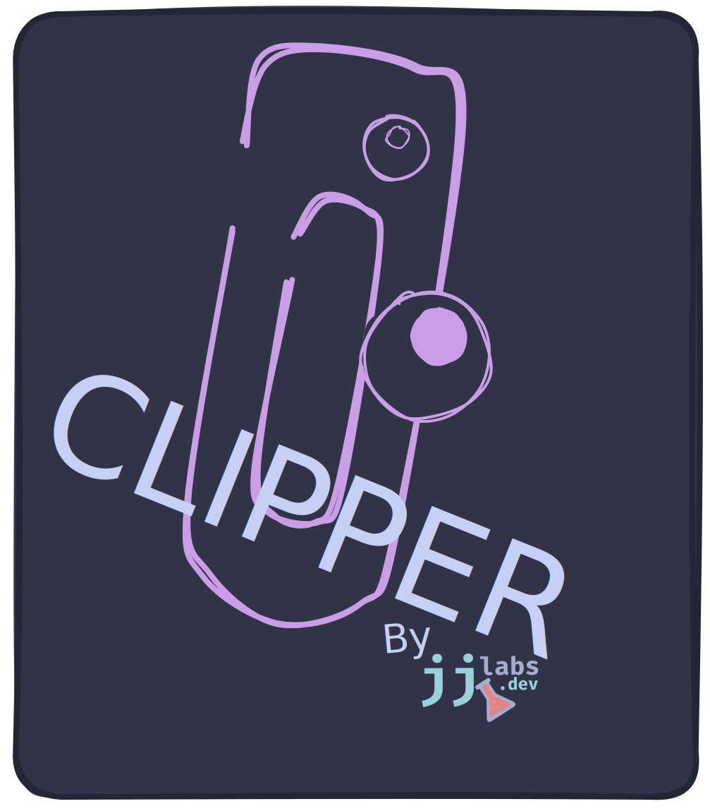

# Clipper

<p align="center">
  
</p>

<p align="center">
  <strong>A native macOS clipboard manager with binary support</strong>
</p>

<p align="center">
  By <a href="https://jjlabs.dev">jjlabs.dev</a>
</p>

---

Clipper is a lightweight clipboard manager for macOS that stores clipboard history (text, images, PDFs, and other binary content) and lets you paste from history using Karabiner-Elements keybindings.

## Features

- Native macOS pasteboard integration via Objective-C
- Automatic content type detection (UTI)
- Binary data support (images, PDFs, etc.)
- Keyboard-driven with Karabiner-Elements
- No GUI, no menubar clutter
- Fast - written in Go with CGo bindings

## Requirements

- macOS 12+
- Go 1.21+
- [Karabiner-Elements](https://karabiner-elements.pqrs.org/)
- [choose](https://github.com/chipsenkbeil/choose) (for selector UI)

## Installation

### Homebrew

```bash
brew install go
brew install --cask karabiner-elements
brew install choose-gui
```

### Build

```bash
git clone https://github.com/jjlabs/clipper.git
cd clipper
go build -o clipper .
```

### Install Binary

```bash
mkdir -p ~/.bin
cp clipper ~/.bin/
```

### Accessibility Permissions

Clipper uses CGEvent to simulate keypresses. You need to grant accessibility access to:

1. Open **System Settings → Privacy & Security → Accessibility**
2. Add `~/.bin/clipper` (Cmd+Shift+G → `~/.bin/` → select `clipper`)
3. Add `/Library/Application Support/org.pqrs/Karabiner-Elements/bin/karabiner_console_user_server`

### Karabiner Configuration

Add the following rule to Karabiner-Elements (Misc → Open config folder → `karabiner.json`, or use the GUI):

```json
{
  "description": "Clipper",
  "manipulators": [
    {
      "type": "basic",
      "from": {
        "key_code": "v",
        "modifiers": {
          "mandatory": ["command"],
          "optional": ["caps_lock"]
        }
      },
      "to": [
        {
          "shell_command": "$HOME/.bin/clipper v"
        }
      ],
      "conditions": [
        {
          "type": "device_if",
          "identifiers": [{ "is_keyboard": true }]
        }
      ]
    },
    {
      "type": "basic",
      "from": {
        "key_code": "v",
        "modifiers": {
          "mandatory": ["command", "shift"],
          "optional": ["caps_lock"]
        }
      },
      "to": [
        {
          "shell_command": "$HOME/.bin/clipper P"
        }
      ],
      "conditions": [
        {
          "type": "device_if",
          "identifiers": [{ "is_keyboard": true }]
        }
      ]
    },
    {
      "type": "basic",
      "from": {
        "key_code": "c",
        "modifiers": {
          "mandatory": ["command"],
          "optional": ["caps_lock"]
        }
      },
      "to": [
        {
          "shell_command": "$HOME/.bin/clipper c"
        }
      ],
      "conditions": [
        {
          "type": "device_if",
          "identifiers": [{ "is_keyboard": true }]
        }
      ]
    },
    {
      "type": "basic",
      "from": {
        "key_code": "c",
        "modifiers": {
          "mandatory": ["command", "shift"],
          "optional": ["caps_lock"]
        }
      },
      "to": [
        {
          "shell_command": "$HOME/.bin/clipper C"
        }
      ],
      "conditions": [
        {
          "type": "device_if",
          "identifiers": [{ "is_keyboard": true }]
        }
      ]
    },
    {
      "type": "basic",
      "from": {
        "key_code": "x",
        "modifiers": {
          "mandatory": ["command", "shift"],
          "optional": ["caps_lock"]
        }
      },
      "to": [
        {
          "shell_command": "$HOME/.bin/clipper x"
        }
      ],
      "conditions": [
        {
          "type": "device_if",
          "identifiers": [{ "is_keyboard": true }]
        }
      ]
    }
  ]
}
```

## Usage

| Shortcut | Action |
|----------|--------|
| `Cmd+C` | Copy + store in history |
| `Cmd+Shift+C` | Store current clipboard (no keypress) |
| `Cmd+V` | Paste most recent item |
| `Cmd+Shift+V` | Select from history and paste |
| `Cmd+Shift+X` | Clear history |

## CLI

```bash
clipper c   # Copy + store
clipper C   # Store current clipboard
clipper v   # Paste last
clipper P   # Paste with selector
clipper x   # Clear store
```

## Storage

Clipboard history is stored in `/tmp/copypasta.bin` as base64-encoded entries with UTI metadata. The store is cleared on reboot.

For persistent storage, change `storeFile` in `main.go`:

```go
const storeFile = "$HOME/.clipper_history"
```

## How It Works

1. Karabiner intercepts `Cmd+C` / `Cmd+V` from physical keyboard
2. Karabiner spawns clipper with the appropriate action
3. Clipper reads/writes the macOS pasteboard via `NSPasteboard`
4. Clipper emits a synthetic `Cmd+C` / `Cmd+V` via `CGEventPost`
5. The synthetic event bypasses Karabiner (no `device_if` match) and reaches the app

## Troubleshooting

### Nothing happens when pressing Cmd+V

Check accessibility permissions. Run:

```bash
~/.bin/clipper v
```

If it works directly but not via Karabiner, add `karabiner_console_user_server` to Accessibility.

### Debug mode

```bash
# Check if Karabiner calls clipper
echo 'shell_command": "$HOME/.bin/clipper v 2>> /tmp/clipper.log"' 

# Check accessibility
# Add to pasteboard.m:
fprintf(stderr, "[DEBUG] AXIsProcessTrusted=%d\n", AXIsProcessTrusted());
```

## License

MIT © [jjlabs.dev](https://jjlabs.dev)
